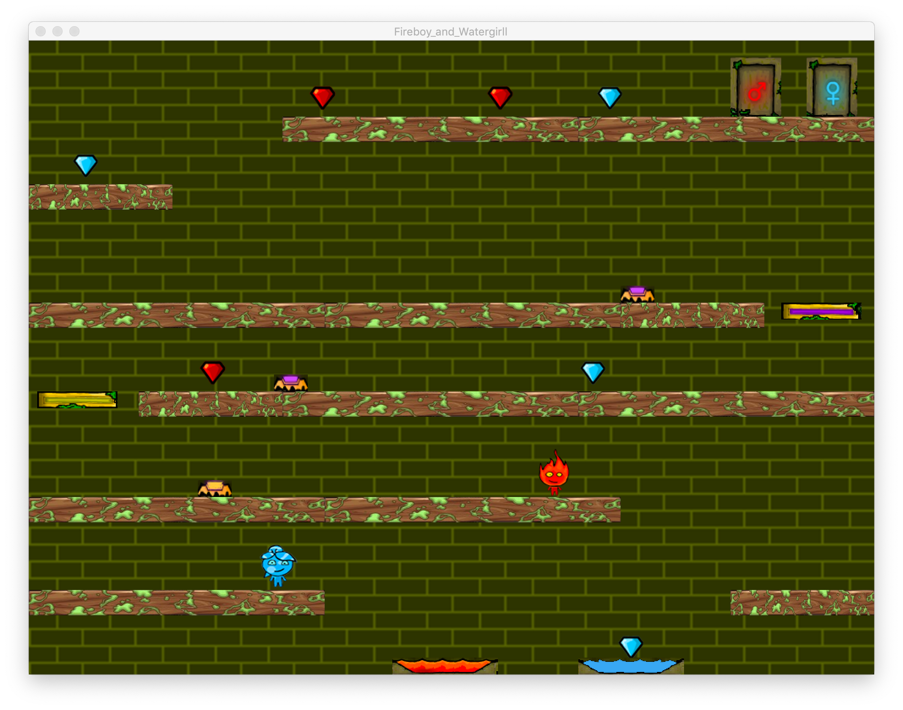

# Final-Project-CS

by Li Cheng and Pavlo Odnonozdriev

We recreated the Fireboy and Watergirl game.

It is a two-player game played on a single keyboard: the first player is supposed to be using the arrow keys, and the second one -- A, W, and D keys. Winning the game requires strategic thinking and coordination, but the game is essentially a jump-and-run one.

The game has two levels. The transition from the first one to the second one happens when both characters stand in front of their respective doors in level one. When they do so in level two, the game is won.

The game was created in Python using the Processing environment. Graphics were created using Adobe Photoshop or downloaded online. For legal purposes, it is a personal project.

In order to run the program, you have to download processing and run the game with it.

Enjoy.

